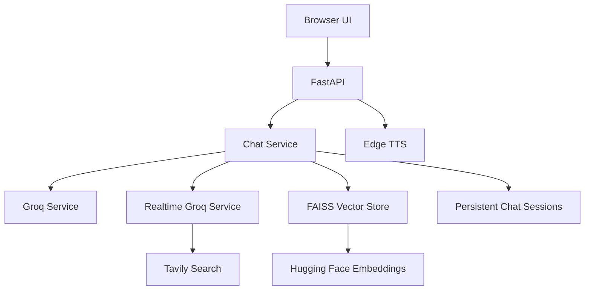

# 🤖 L.U.C.Y. — Personal AI Voice Assistant

> **Learning Unit & Cognitive Yield**

L.U.C.Y. is a Python/FastAPI-based personal AI assistant that combines conversational AI, retrieval-augmented context, realtime web search, streaming responses, and text-to-speech into one assistant experience.

## ✨ Features

- 💬 General AI conversations
- ⚡ Streaming chat responses
- 🌐 Realtime web-assisted responses using Tavily
- 🧠 Local FAISS vector store for retrieval
- 🔎 Hugging Face sentence-transformer embeddings
- 🔊 Text-to-speech with Edge TTS
- 🗂️ Persistent chat sessions
- 🩺 Health/status endpoint
- 📱 Browser-oriented frontend
- 🔁 Retry/fallback handling for AI API failures

## 🏗️ Architecture



### Request flow

```text
User message
     ↓
FastAPI endpoint
     ↓
Chat Service
     ├── Vector retrieval
     ├── General Groq response
     └── Realtime search + Groq response
     ↓
Streaming response
     ↓
Optional Edge TTS
     ↓
Browser UI
```

## 🧠 AI & Retrieval

L.U.C.Y. uses a service-oriented backend rather than placing all assistant logic in one file.

### Vector store

The vector-store service:

1. Loads learning-data text files
2. Loads persisted chat history
3. Splits documents into chunks
4. Generates embeddings with a Hugging Face model
5. Builds a FAISS index
6. Retrieves relevant context for queries

### Realtime mode

Realtime queries can be enriched with Tavily search results before being passed to the language-model service.

This gives the assistant a separate path for queries that need fresh external information.

## 🔊 Voice & TTS

The application supports text-to-speech through **Edge TTS**.

The backend can generate speech asynchronously and stream audio alongside streamed text responses.

## 📁 Repository Structure

```text
lucy_ai/
├── app/
│   ├── main.py
│   ├── models.py
│   ├── services/
│   │   ├── chat_service.py
│   │   ├── groq_service.py
│   │   ├── realtime_service.py
│   │   └── vector_store.py
│   └── utils/
│       ├── retry.py
│       └── time_info.py
│
├── frontend/
│   ├── index.html
│   ├── script.js
│   ├── style.css
│   └── orb.js
│
├── config.py
├── requirements.txt
└── run.py
```

## 🚀 Getting Started

### 1. Clone

```bash
git clone https://github.com/HYperX007/lucy_ai.git
cd lucy_ai
```

### 2. Create a virtual environment

```bash
python -m venv .venv
```

Windows PowerShell:

```powershell
.\.venv\Scripts\Activate.ps1
```

### 3. Install dependencies

```bash
pip install -r requirements.txt
```

### 4. Configure environment variables

Create a local `.env` file and provide the API credentials expected by the configuration.

At minimum, the project expects a **Groq API key**. Realtime search additionally uses a **Tavily API key**.

> Never commit API keys or other secrets to GitHub.

### 5. Start L.U.C.Y.

```bash
python run.py
```

The development server runs on port **8000** by default.

The API includes a health endpoint and the frontend is served by the FastAPI application.

## 🔌 Main API Endpoints

| Endpoint | Purpose |
|---|---|
| `GET /api` | API information |
| `GET /health` | Service health |
| `POST /chat` | General chat |
| `POST /chat/stream` | Streaming general chat |
| `POST /chat/realtime` | Realtime chat |
| `POST /chat/realtime/stream` | Streaming realtime chat |
| `GET /chat/history/{session_id}` | Retrieve chat history |
| `POST /tts` | Generate text-to-speech |

## 🧰 Tech Stack

**Backend**
- Python
- FastAPI
- Uvicorn
- Pydantic

**AI**
- Groq
- LangChain
- Hugging Face Sentence Transformers
- FAISS

**Realtime / Voice**
- Tavily
- Edge TTS

**Frontend**
- HTML
- CSS
- JavaScript
- Web APIs

## 🔐 Security Notes

This is a personal/development assistant project.

Before public deployment, review:

- CORS configuration
- API-key handling
- authentication
- rate limiting
- persistent chat-data privacy
- request validation
- production logging

Do not expose secrets through source code, frontend JavaScript, or committed `.env` files.

## 📌 Project Status

L.U.C.Y. is an evolving personal AI assistant project. The architecture has been refactored into dedicated services for chat, retrieval, realtime search, and AI providers, making it easier to extend and experiment with new capabilities.

## 👤 Author

**Tanishque Mondal**

B.Tech — Electronics & Computer Science  
Narula Institute of Technology

- LinkedIn: https://www.linkedin.com/in/tanishque-mondal-9b62b3397/
- GitHub: https://github.com/HYperX007
